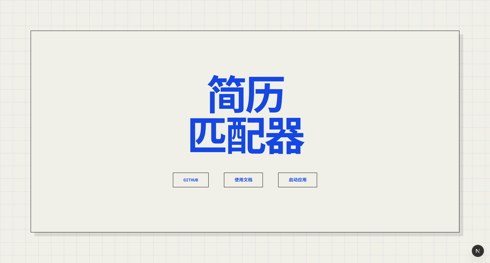
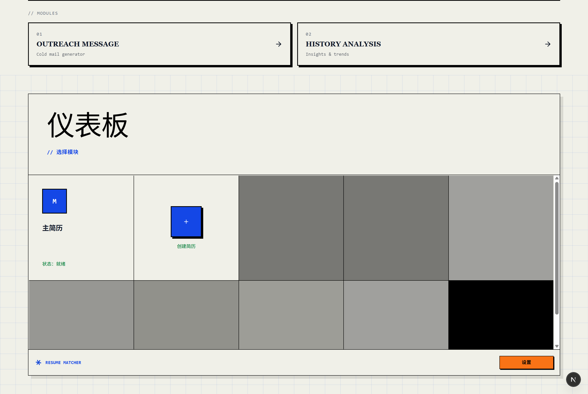
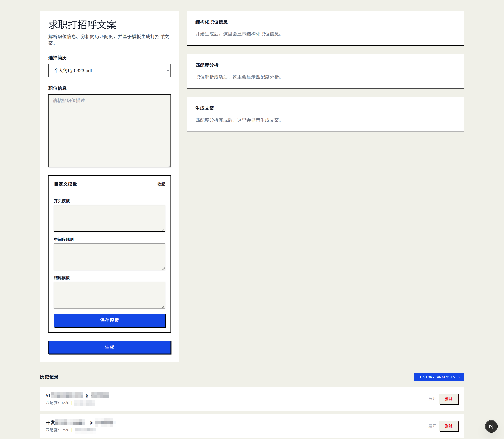
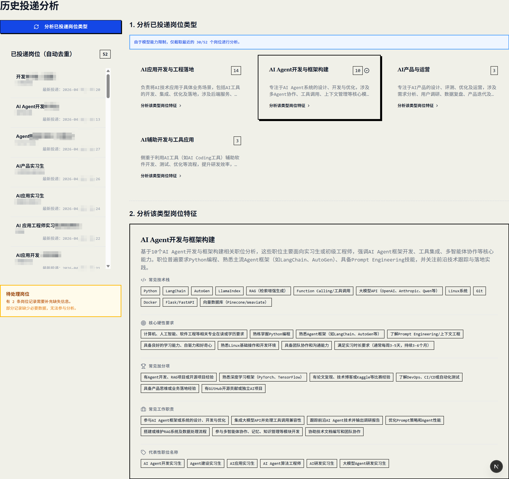

# resumeHello

> Your job hunting companion that says hello, tracks history, and maps your career landscape.

**resumeHello** 是一个基于 [Resume-Matcher](https://github.com/srbhr/Resume-Matcher) (1.1 Voyager)深度定制的求职辅助工具。相比原项目，我们新增或调整了以下功能：

- ✅ **打招呼语句生成** – 在独立页面中，根据简历和岗位描述自动生成一段友好的开场白/自荐语。该功能与简历生成模块解耦，方便你在求职招聘平台上广泛联系雇主。
- ✅ **匹配度评分** – 对岗位描述进行结构化分析，给出可量化的匹配程度。
- ✅ **历史投递记录** – 保存每一次投递的简历、岗位描述、匹配结果以及生成的内容。
- ✅ **岗位分类与分析** – 基于历史投递数据，自动聚类岗位类型。
- ✅ **岗位画像刻画** – 提炼每一类岗位的核心特点、常见技术栈及技能要求。


## 工作流

1. 上传主简历（PDF 或 DOCX），可编辑简历补全识别缺失的信息
2. 在 http://localhost:3000/outreach 粘贴要投递的职位描述，以及打招呼模板，获得大招呼语句以及匹配度分析
3. 在 http://localhost:3000/outreach/history-analysis 分析已投递岗位类型，并得到每类岗位的分析报告


## 效果预览

> 以下图片展示了当前已实现的核心功能模块界面：

  
*图1：入口页面（点击「启动运行」即可体验完整功能）*

  
*图2：应用面板页面*

  
*图3：智能生成打招呼语句及岗位匹配度量化分析*

  
*图4：投递历史记录追踪与岗位分布画像追踪*


## 快速开始

### 环境准备

| 工具 | 最低版本 | 如何检查 | 安装 |
|------|----------|----------|------|
| **Python** | 3.13+ | `python --version` | [python.org](https://python.org) |
| **Node.js** | 22+ | `node --version` | [nodejs.org](https://nodejs.org) |
| **npm** | 10+ | `npm --version` | 随 Node.js 一起安装 |
| **uv** | 最新 | `uv --version` | [astral.sh/uv](https://docs.astral.sh/uv/getting-started/installation/) |
| **Git** | 任意 | `git --version` | [git-scm.com](https://git-scm.com) |


### 项目运行

```bash
git clone https://github.com/InTheFuture7/resumehello.git
cd resumehello
# 后端（终端 1）
cd apps/backend
cp .env.example .env        # 配置你的 AI 提供商
uv sync                     # 安装依赖
.venv/Scripts/activate      # 激活虚拟环境
uv run uvicorn app.main:app --reload --port 8000

# 前端（终端 2）
cd apps/frontend
npm install
npm run dev
```

> 除了在 .env 中配置大模型，也可打开 **<http://localhost:3000>**，在"设置"中配置
> 
> 注意：设置语言时，需要保持界面语言和内容语言一致